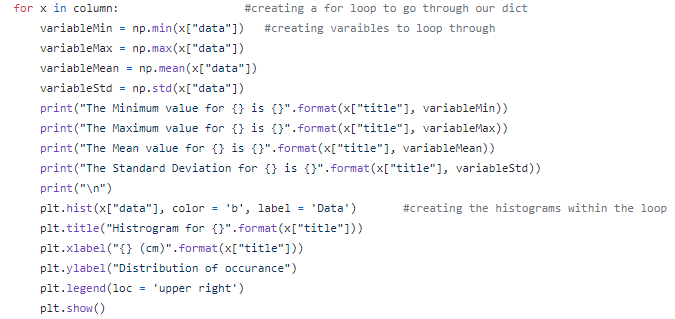
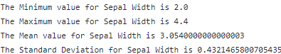
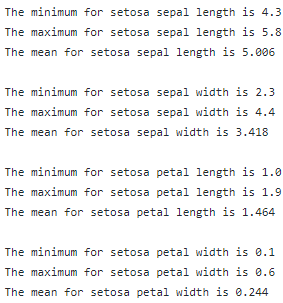
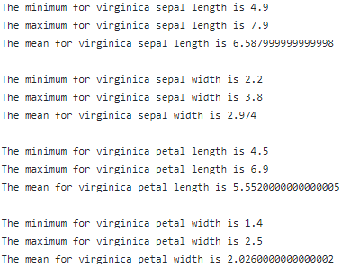
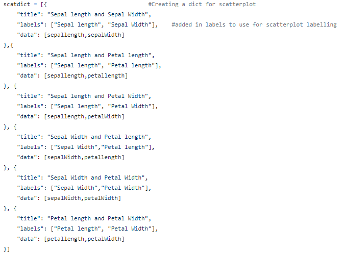

# IrisDataSet-Project
This is the repository created for the project within PANDS Module 2021. The following statement is the problem statement for the project, as per the breif.\
'This project concerns the well-known Fisher’s Iris data set. You must research the data set
and write documentation and code (in Python) to investigate it. An online search for
information on the data set will convince you that many people have investigated it
previously. You are expected to be able to break this project into several smaller tasks that
are easier to solve, and to plug these together after they have been completed.
You might do that for this project as follows:
1. Research the data set online and write a summary about it in your README.
2. Download the data set and add it to your repository.
3. Write a program called analysis.py that:
• outputs a summary of each variable to a single text file,
• saves a histogram of each variable to png files, and
• outputs a scatter plot of each pair of variables.
It might help to suppose that your manager has asked you to investigate the data set, with a
view to explaining it to your colleagues. Imagine that you are to give a presentation on the
data set in a few weeks’ time, where you explain what investigating a data set entails and how
Python can be used to do it. You have not been asked to create a deck of presentation slides,
but rather to present your code and its output to them.'

# Task Preperation 

For the purpose of this task, the author first created a 'Project Planner' which was used to help guide and manage this project. This planner will have undergone a number of changes through the process of the  project, but will be a constant point of reference throughout. 

Plan for the Project: 

1. Create a repository to be used for the project.
2. Carry out background research on the IRIS Dataset, and write up a concise summary. 
3. Create the appropriate folders to store the required information and data (update and create as the project goes on).
4. Monitor References: Create a word doc to store references throughout the project. Add to Readme near the end.
5. Download the IRIS Dataset.
6. Breakdown the tasks within the project in relation to the investigation of the dataset. Examine the research question, and create a plan on how I intend to investigate the dataset and produce the required outputs.
7. Spent time researching and revising appropriately and wisely. 
8. Make regular and appropriate commits throughout. 

# Background Information 
The Iris Dataset is a multivariate dataset that contains 4 features of 50 samples of three species of the Irish flower, namely _setosa_, _virginica_, and _versicolor_. The 4 features within the dataset are:
1. Lenght of sepal in cm.
2. Width of sepal in cm.
3. Lenght of petal in cm.
4. Width of petal in cm. 

The dataset was first introduced by British statistician, eugenicist, and biologist Ronald Fisher in his 1963 paper '_The use of multiple measurements in taxonomic problems_', which is available to read at <https://onlinelibrary.wiley.com/doi/abs/10.1111/j.1469-1809.1936.tb02137.x>.
The dataset is was introduced as an example of linear discriminant analysis, which refers to 'a method used to find a linear combination of features that characterise or separate two or more classes of objects or events'.
 As such, based on the combination of the four features mentioned above, Fisher developed a linear discrimination model which was able to distinguish between the three species of Iris. A snapshot of Fisher's original data can be viewed below.\

# The Environment 
A number of programmes and resources were essential to the completion of this project. This include: _Anaconda_, _Python_, _Visual Studio Code_, _The Iris Dataset_, and _GitHub_.
A selection of Python Library extensions were also utilized throughout. Time was spent becoming familiar with these libraries through both weekly lectures and independent research. The libraries used in this project are: 
* Matplotlib: Matplotlib is a graph plotting library in Python that serves as a visualisation utility. It is a comprehensive library for creating static, animated, and interactive visualisations in Python.
* NumPy: NumPy is a Python library used for working with arrays. Using NumPy has a number of benefits to data scientists, including increased computational speed, fewer loops, clearer code, and improved quality. It is seen as the de facto standard for multidimensional arrays in Python.
* pandas: Pandas is a python library used for working with data sets, and has functions for analysing, cleaning, exploring, and manipulating data. Pandas allows us to analyse big data and make conclusions based on statistical theories.

# Exploration of the Data 
Below you will find the results of the exploration of the dataset using Python. As previously mentioned, the code created to run this exploration underwent a number of developments and updates throughout the process.

Based on the background knowledge known about the Iris Dataset, there are certain assumptions that can be made around the data within this dataset. However, the author did not take such assumptions for granted and spent time exploring the data to confirm that the dataset I was using contained the following information before beginning my project: 
1.	That the data contained the correct number of rows and columns (150, 5) 
2.	That I had correctly names the five columns.
3.	That the data contained the three species of flower
4.	That the data was evenly distributed between the three flowers (50 each)

 

## Histograms for each variable

As part of the exploration of the dataset code was written to produce Histogram data for each of the following variables: 
1.	Sepal Length 
2.	Sepal Width 
3.	Petal Length 
4.	Petal Width 

A histogram is a bar graph-like representation of data that buckets a range of outcomes into columns along the x-axis. The y-axis represents the number count or percentage of occurrences in the data for each column and can be used to visualize data distributions. To help support and describe the histograms, the minimum, maximum, mean, and standard deviation of each variable were also pulled. 
The first step in getting the above information creating a dict containing each the data and its corresponding data. 

Using the above dictionary, a for loop was used to loop through the dictionary data, and output the min, max, mean, and standard deviation of each variable. It was also used to plot and produce the histograms provided below. 

### Sepal Length
The Sepal Length Histogram and the descriptive statistics for Sepal Length are provided below:

### Sepal Width

The Sepal Width Histogram and the descriptive statistics for Sepal Width are provided below:

 

### Petal Length
The Petal Length Histogram and the descriptive statistics for Petal Length are provided below:

### Petal Width
The Petal Width Histogram and the descriptive statistics for Petal Width are provided below:

## Histograms for Each Flower
To further investigate the data, separate analysis was carried out for the four variables (sepal length, sepal width, petal length, petal width) for each of the three species Iris flower. The code was developed and improved over the course of the project. 

Firstly, the data for each flower were placed into separate dictionaries, with another dictionary being made storing each flower and its corresponding data: 

The code provided above was then used within a for loop to produce the min, mean, and max for each of the four variables per species, while also outputting histograms to visualise the data: 
 

### Setosa Flower 
Below is a matrix containing histograms for each variable of the Setosa Flower: 

and the min, mean, max for each: 

 

### Versicolor Flower 
Below is a matrix containing histograms for each variable of the Versicolor Flower: 

and the min, mean, max for each: 

 

### Virginica Flower 
Below is a matrix containing histograms for each variable of the Virginica Flower: 

and the min, mean, max for each: 

 

## Scatter Plot for each Pair of Variables 
As part of this project we were asked to create scatter plots for each pair of variables. A scatter plot (aka scatter chart, scatter graph) uses dots to represent values for two different numeric variables. The position of each dot on the horizontal and vertical axis indicates values for an individual data point. Scatter plots are used to observe relationships between variables.

First, a dictionary containing the required information was created. 

This dictionary was then used for a loop in which the scatter plots were created. 

The below chart shows potential distributions found on the scatterplots and what they indicate. This will be used as a point of reference to help explain the below plots.

The correlation is said to be positive when the values increase together, while the correlation is said to be negative when the values decrease together. 

### Sepal Length and Sepal Width 
Below is a scatter plot of the data for sepal length and sepal width 

As can be seen, there appears to a very weak, if any correlation at all within the data between Sepal Lenght and Sepal Width. 
### Sepal Length and Petal Length
Below is a scatter plot of the data for sepal length and petal length 

As can be seen, there appears to be a high positive correlation between Sepal Lenght and Petal Lenght. 
### Sepal Length and Petal Width
Below is a scatter plot of the data for sepal length and petal width 

As can be seen, there appears to be a low positive correlation between Sepal Length and Petal Width.
### Sepal Width and Petal Length 
Below is a scatter plot of the data for sepal width and petal length 

As can be seen, there appears to be no significant correlation between Sepal Width and Petal Length
### Sepal Width and Petal Width
Below is a scatter plot of the data for sepal width and petal width 

As can be seen, there appears to be no significant correlation between Sepal Length and Petal Lenght
### Petal Length and Petal Width 
Below is a scatter plot of the data for petal length and petal width 

As can be seen, there appears to be a high positive correlation between Petal Lenght and Petal Width

## References

https://en.wikipedia.org/wiki/Iris_flower_data_set

https://en.wikipedia.org/wiki/Linear_discriminant_analysis

https://www.w3schools.com/python/matplotlib_pyplot.asp

https://realpython.com/numpy-tutorial/#:~:text=NumPy%20is%20a%20Python%20library,any%20Python%20data%20scientists%20journey

https://www.w3schools.com/python/pandas/pandas_intro.asp

https://www.w3schools.com/python/pandas/default.asp 

https://machinelearningmastery.com/machine-learning-in-python-step-by-step/

https://realpython.com/python-csv/

https://stackoverflow.com/questions/3518778/how-do-i-read-csv-data-into-a-record-array-in-numpy

http://www.hpc-carpentry.org/hpc-python/03-lists/

https://jakevdp.github.io/PythonDataScienceHandbook/02.04-computation-on-arrays-aggregates.html

https://bit.ly/325l7aw

https://learnonline.gmit.ie/pluginfile.php/293981/mod_label/intro/Lab%2005%20dataStructures.pdf

https://jakevdp.github.io/WhirlwindTourOfPython/06-built-in-data-structures.html

https://realpython.com/iterate-through-dictionary-python/

https://pandas.pydata.org/docs/reference/api/pandas.DataFrame.hist.html

https://www.kite.com/python/docs/matplotlib.figure.Figure.suptitle

https://www.w3schools.com/python/python_ml_scatterplot.asp

https://www.w3schools.com/python/matplotlib_scatter.asp

https://stackoverflow.com/questions/30013511/python-plot-a-graph-from-values-inside-dictionary/30013848

